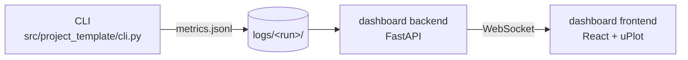

# Architecture

```mermaid
flowchart LR
  cli[CLI<br/>src/project_template/cli.py] -->|metrics.jsonl| logs[(logs/&lt;run&gt;/)]
  logs --> backend[dashboard backend<br/>FastAPI]
  backend -->|WebSocket| ui[dashboard frontend<br/>React + uPlot]
```

Replace this with the real parts of the project once they exist. One box per module,
one arrow per data hand-off, labelled with the format.
